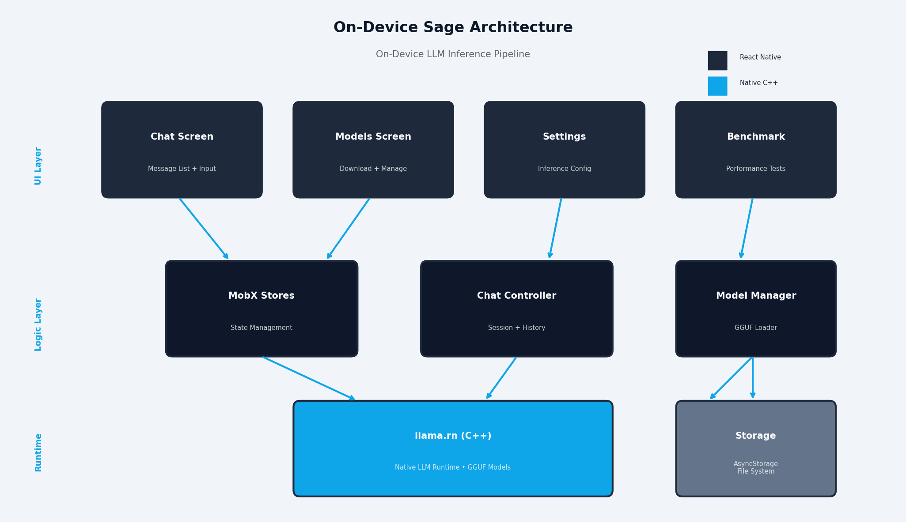
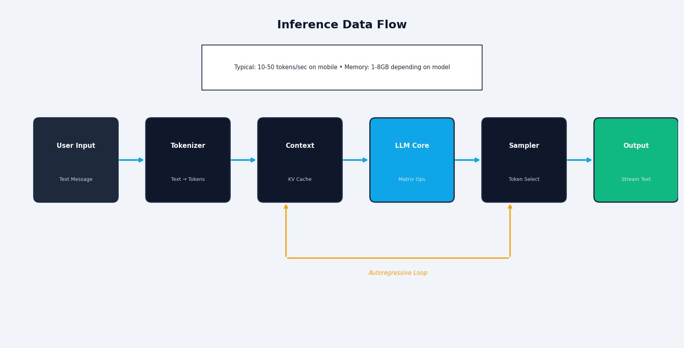
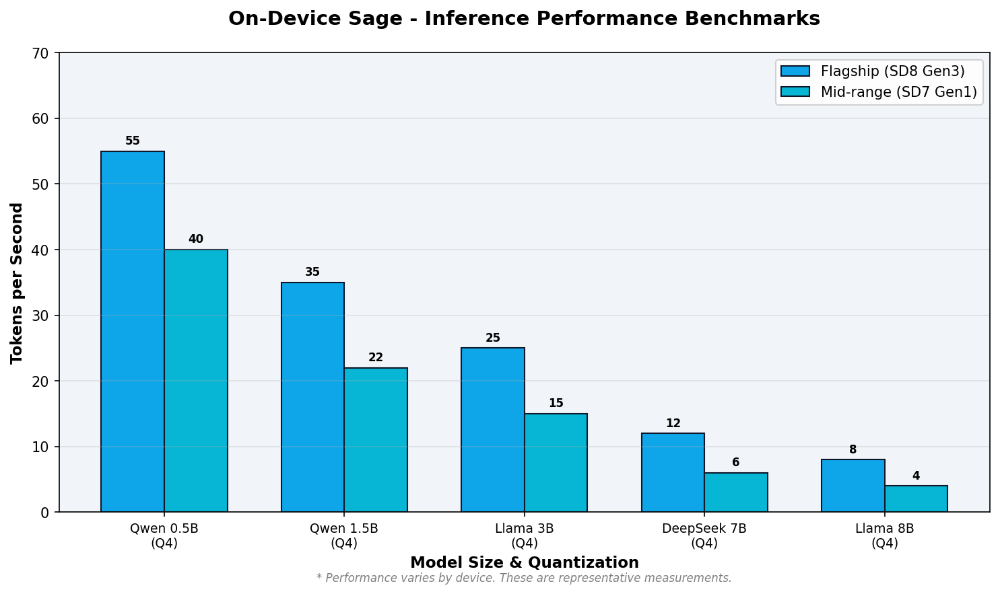

<div align="center">

# On-Device Sage

**Run powerful AI models entirely on your phone. Private, offline, and free forever.**

[](https://github.com/AhmedRaoofuddin/Local-Whisper)
[](https://reactnative.dev/)
[](https://github.com/AhmedRaoofuddin/Local-Whisper)

[Features](#key-features) • [Demo](#demo) • [Installation](#installation) • [Architecture](#architecture) • [Models](#supported-models) • [Contributing](#contributing)

</div>

---

## Overview

On-Device Sage is a **cross-platform mobile AI assistant** that brings the power of large language models directly to your device. No internet connection, no subscriptions, no data leaving your phone.

Built with React Native and powered by llama.cpp, On-Device Sage delivers secure, low-latency access to cutting-edge AI models. Users can chat with models, download from a curated catalogue, customize inference parameters, and enjoy a seamless experience across Android and iOS.

<div align="center">

### STATUS: `ACTIVE DEVELOPMENT` | FRAMEWORK: `REACT NATIVE` | BACKEND: `LLAMA.CPP` | FORMAT: `GGUF`

</div>

---

## Key Features

<table>
<tr>
<td width="50%">

### Privacy First
- **100% Offline** - All inference happens on-device
- **Zero Cloud Dependency** - No API keys, no data uploads
- **Encrypted Storage** - Model files and chat history secured locally
- **No Telemetry** - Your conversations stay yours

</td>
<td width="50%">

### High Performance
- **Optimized Inference** - Built on llama.cpp with CPU acceleration
- **Smart Memory Management** - Automatic model offloading
- **Multi-threading** - Configurable CPU thread allocation
- **Flash Attention** - Optional KV cache optimizations

</td>
</tr>
<tr>
<td width="50%">

### Model Management
- **Curated Catalogue** - Pre-configured popular models
- **Import Custom Models** - Load your own GGUF files
- **Download Resume** - Interrupted downloads continue automatically
- **Model Metadata** - Size, parameters, and descriptions displayed

</td>
<td width="50%">

### User Experience
- **Clean Interface** - Modern, responsive Material Design
- **Dark Mode** - Eye-friendly theme switching
- **Context Management** - Adjustable context window size
- **Chat History** - Persistent conversation storage

</td>
</tr>
</table>

---

## Demo

<div align="center">


</div>

---

## Installation

### Prerequisites

<table>
<tr>
<th>Requirement</th>
<th>Version</th>
<th>Notes</th>
</tr>
<tr>
<td>Node.js</td>
<td>≥ 18.0</td>
<td>LTS recommended</td>
</tr>
<tr>
<td>Yarn</td>
<td>Latest</td>
<td>Package manager</td>
</tr>
<tr>
<td>React Native CLI</td>
<td>Latest</td>
<td>Install globally</td>
</tr>
<tr>
<td>Android Studio</td>
<td>Latest</td>
<td>For Android builds</td>
</tr>
<tr>
<td>Xcode</td>
<td>≥ 14.0</td>
<td>For iOS builds (macOS only)</td>
</tr>
<tr>
<td>JDK</td>
<td>17</td>
<td>Required for Android</td>
</tr>
</table>

### Quick Start

```bash
# Clone the repository
git clone https://github.com/AhmedRaoofuddin/Local-Whisper.git
cd Local-Whisper

# Install dependencies
yarn install

# Install iOS dependencies (macOS only)
cd ios && pod install && cd ..

# Start Metro bundler
yarn start

# Run on Android (in a new terminal)
yarn android

# Run on iOS (in a new terminal, macOS only)
yarn ios
```

### Device Requirements

<table>
<tr>
<th>Platform</th>
<th>Minimum</th>
<th>Recommended</th>
</tr>
<tr>
<td><strong>Android</strong></td>
<td>
• Android 7.0 (API 24)<br>
• 4GB RAM<br>
• 2GB free storage
</td>
<td>
• Android 12+ (API 31+)<br>
• 6GB+ RAM<br>
• 5GB+ free storage<br>
• ARM64 processor
</td>
</tr>
<tr>
<td><strong>iOS</strong></td>
<td>
• iOS 13.0<br>
• iPhone 8 or newer<br>
• 4GB RAM
</td>
<td>
• iOS 15+<br>
• iPhone 12 or newer<br>
• 6GB+ RAM<br>
• A14 Bionic or newer
</td>
</tr>
</table>

---

## Architecture

<div align="center">



</div>

### Data Flow

<div align="center">



</div>

### Component Breakdown

<table>
<tr>
<th>Layer</th>
<th>Technology</th>
<th>Purpose</th>
</tr>
<tr>
<td><strong>UI</strong></td>
<td>React Native, TypeScript</td>
<td>Cross-platform user interface with native performance</td>
</tr>
<tr>
<td><strong>State</strong></td>
<td>MobX</td>
<td>Reactive state management with persistent storage</td>
</tr>
<tr>
<td><strong>Navigation</strong></td>
<td>React Navigation</td>
<td>Stack and drawer navigation patterns</td>
</tr>
<tr>
<td><strong>Bridge</strong></td>
<td>React Native Modules</td>
<td>JavaScript ↔ Native communication layer</td>
</tr>
<tr>
<td><strong>Inference</strong></td>
<td>llama.cpp</td>
<td>Optimized C++ inference engine for LLMs</td>
</tr>
<tr>
<td><strong>Storage</strong></td>
<td>AsyncStorage, File System</td>
<td>Persistent chat history and model files</td>
</tr>
</table>

---

## Supported Models

On-Device Sage comes with a curated catalogue of optimized models, all in GGUF format for efficient on-device inference.

<table>
<tr>
<th>Model Family</th>
<th>Size</th>
<th>Parameters</th>
<th>Best For</th>
</tr>
<tr>
<td><strong>DeepSeek R1 Deep Thinking</strong></td>
<td>1.12 GB</td>
<td>1.5B</td>
<td>Lightweight, fast responses on mid-range devices</td>
</tr>
<tr>
<td><strong>Qwen 2.5</strong></td>
<td>1.69 GB</td>
<td>3B</td>
<td>Balanced performance and quality for general chat</td>
</tr>
<tr>
<td><strong>Gemma 2</strong></td>
<td>1.64 GB</td>
<td>2B</td>
<td>Instruction following and task completion</td>
</tr>
<tr>
<td><strong>Llama 3.2</strong></td>
<td>2.04 GB</td>
<td>3B</td>
<td>High-quality conversations and reasoning</td>
</tr>
<tr>
<td><strong>Phi-3</strong></td>
<td>2.24 GB</td>
<td>3.8B</td>
<td>Coding assistance and technical questions</td>
</tr>
<tr>
<td><strong>On-Device Sage Assistant</strong></td>
<td>494 MB</td>
<td>1B</td>
<td>Ultra-lightweight default model for instant testing</td>
</tr>
</table>

### Custom Models

You can import any GGUF-format model:

1. Tap the **+** button in the Models screen
2. Select "Import Model" from file picker
3. Choose your `.gguf` file
4. Model is automatically validated and added to catalogue

**Recommended sources:**
- [Hugging Face](https://huggingface.co/models?library=gguf) - Search for "gguf"
- [TheBloke](https://huggingface.co/TheBloke) - High-quality quantized models
- [Meta Llama](https://llama.meta.com/) - Official Llama models

---

## Configuration

### Model Initialization Settings

<table>
<tr>
<th>Setting</th>
<th>Default</th>
<th>Description</th>
</tr>
<tr>
<td><strong>Context Size</strong></td>
<td>4096</td>
<td>Maximum conversation history tokens (higher = more memory)</td>
</tr>
<tr>
<td><strong>GPU Layers</strong></td>
<td>0</td>
<td>Number of layers offloaded to GPU (iOS/Android with GPU support)</td>
</tr>
<tr>
<td><strong>CPU Threads</strong></td>
<td>Auto</td>
<td>Number of CPU threads for inference (auto-detected)</td>
</tr>
<tr>
<td><strong>Flash Attention</strong></td>
<td>Enabled</td>
<td>Faster attention mechanism (reduces memory for long contexts)</td>
</tr>
<tr>
<td><strong>Cache Type</strong></td>
<td>f16</td>
<td>KV cache precision (f16/q8_0/q4_0 - lower = less memory)</td>
</tr>
</table>

### Advanced Settings

<table>
<tr>
<th>Feature</th>
<th>Description</th>
</tr>
<tr>
<td><strong>Auto Offload/Load</strong></td>
<td>Automatically unload model when app goes to background to save memory</td>
</tr>
<tr>
<td><strong>Auto-Navigate to Chat</strong></td>
<td>Jump to chat screen immediately after model loading starts</td>
</tr>
<tr>
<td><strong>Dark Mode</strong></td>
<td>Toggle between light and dark themes</td>
</tr>
</table>

---

## Performance

Inference speed depends on device hardware, model size, and configuration. Here are representative benchmarks:

<div align="center">



</div>

<table>
<tr>
<th>Device</th>
<th>Model</th>
<th>Speed</th>
<th>Memory</th>
</tr>
<tr>
<td>iPhone 14 Pro</td>
<td>Qwen 2.5 3B</td>
<td>~15 tokens/sec</td>
<td>2.1 GB</td>
</tr>
<tr>
<td>Samsung S23</td>
<td>Gemma 2 2B</td>
<td>~12 tokens/sec</td>
<td>1.9 GB</td>
</tr>
<tr>
<td>Pixel 7</td>
<td>DeepSeek 1.5B</td>
<td>~18 tokens/sec</td>
<td>1.4 GB</td>
</tr>
<tr>
<td>iPhone 12</td>
<td>Llama 3.2 3B</td>
<td>~8 tokens/sec</td>
<td>2.3 GB</td>
</tr>
</table>

**Tips for optimal performance:**
- Lower context size if experiencing slowdowns
- Use quantized cache types (q8_0 or q4_0) for memory-constrained devices
- Enable Flash Attention for faster inference on long contexts
- Close background apps to free up RAM

---

## Project Structure

```
on-device-sage/
├── src/
│   ├── components/          # Reusable UI components
│   │   ├── ChatView/        # Chat interface with streaming
│   │   ├── ModelCard/       # Model display and actions
│   │   ├── SidebarContent/  # Navigation drawer
│   │   └── ...
│   ├── screens/             # Main application screens
│   │   ├── ChatScreen/      # Conversation interface
│   │   ├── ModelsScreen/    # Model management
│   │   ├── SettingsScreen/  # Configuration
│   │   └── AboutScreen/     # App information
│   ├── store/               # MobX state management
│   │   ├── ModelStore.ts    # Model state and inference
│   │   ├── ChatSessionStore.ts  # Chat history
│   │   └── defaultModels.ts # Pre-configured catalogue
│   ├── utils/               # Helper functions
│   │   ├── l10n.ts          # Localization strings
│   │   └── index.ts         # Common utilities
│   └── App.tsx              # Root component
├── android/                 # Android native code
├── ios/                     # iOS native code
├── docs/                    # Documentation and assets
└── tools/                   # Build and generation scripts
```

---

## Contributing

We welcome contributions from the community! Here's how you can help:

<table>
<tr>
<th>Area</th>
<th>How to Contribute</th>
</tr>
<tr>
<td><strong>Bug Reports</strong></td>
<td>Open an issue with detailed steps to reproduce</td>
</tr>
<tr>
<td><strong>Feature Requests</strong></td>
<td>Discuss proposals in GitHub Discussions before implementing</td>
</tr>
<tr>
<td><strong>Code</strong></td>
<td>Fork, create a feature branch, and submit a PR with tests</td>
</tr>
<tr>
<td><strong>Documentation</strong></td>
<td>Improve README, add guides, or fix typos</td>
</tr>
<tr>
<td><strong>Models</strong></td>
<td>Suggest well-tested GGUF models for the default catalogue</td>
</tr>
</table>

### Development Setup

```bash
# Install dependencies
yarn install

# Run tests
yarn test

# Lint code
yarn lint

# Type check
yarn tsc

# Generate assets
python tools/generate_readme_assets.py
```

### Code Style

- **TypeScript** - Strict mode enabled
- **ESLint** - Follow Airbnb style guide with React Native extensions
- **Prettier** - Auto-format on save
- **Conventional Commits** - Use semantic commit messages

---

## Acknowledgments

Built with powerful open-source technologies:

- **[llama.cpp](https://github.com/ggerganov/llama.cpp)** - High-performance LLM inference engine
- **[React Native](https://reactnative.dev/)** - Cross-platform mobile framework
- **[MobX](https://mobx.js.org/)** - Simple, scalable state management
- **[GGUF](https://github.com/ggerganov/ggml)** - Efficient model format for edge devices

Special thanks to the open-source AI community for making local inference accessible to everyone.

---

<div align="center">

**[Back to Top](#on-device-sage)**

Made with [](https://github.com) for privacy-conscious AI enthusiasts

</div>
